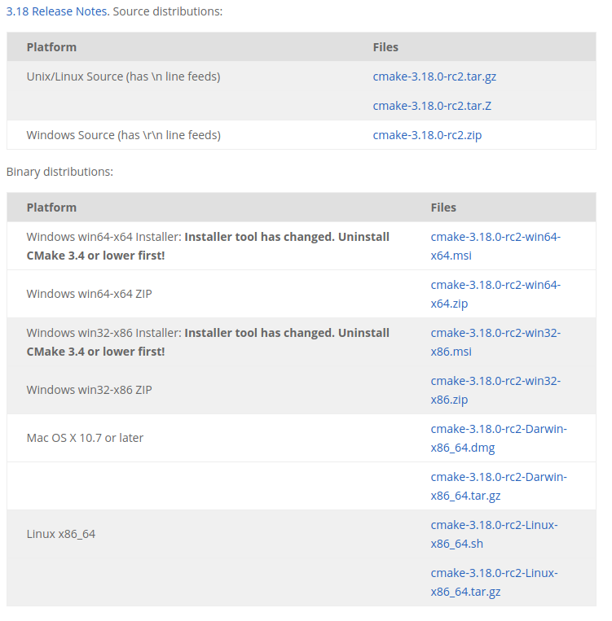
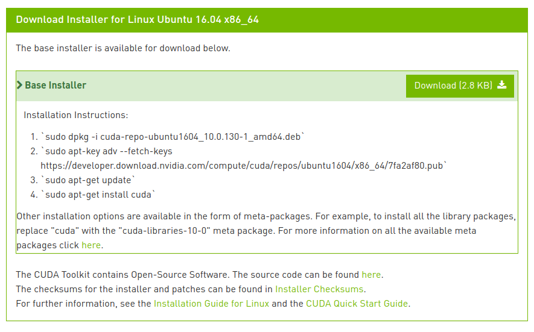
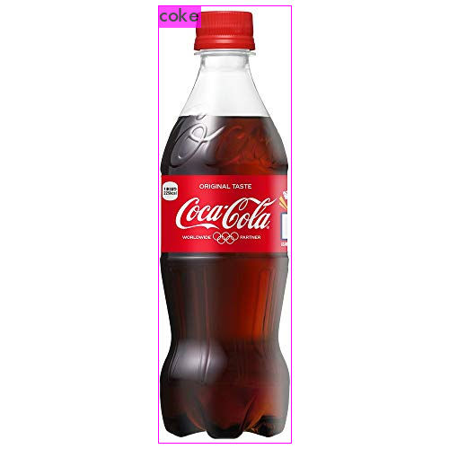
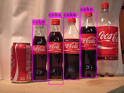
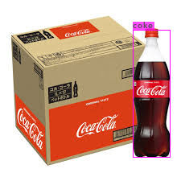
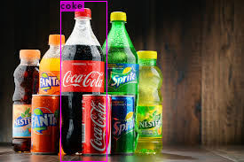
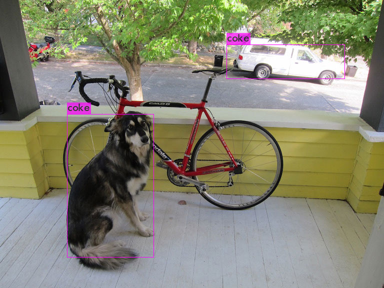
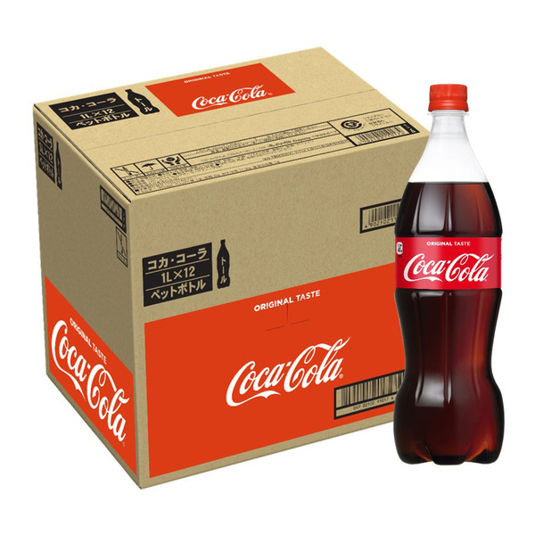
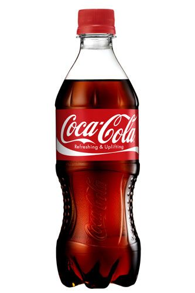

# yoloにおけるカスタムデータの学習について

## 導入

yoloには事前に学習済みのデータセット（[yolov4.weights](https://github.com/AlexeyAB/darknet/releases/download/darknet_yolo_v3_optimal/yolov4.weights), [yolov4.cfg](https://raw.githubusercontent.com/AlexeyAB/darknet/master/cfg/yolov4.cfg)）があるが、既存のデータセットをカスタマイズしたり、新たにデータセットを作成するような必要もあると思うので、本文でyoloの導入からカスタムデータの学習までをまとめる

## セットアップ手順
(Ubuntu 16.04を想定)

yoloの実行やカスタムデータの学習に際しては以下の環境が必要である

- CMake>=3.12
- CUDA 10.0
- cuDNN>=7.0 for CUDA 10.0
- OpenCV>=2.4

それぞれ以下に導入手順をまとめる

### CMake
#### 既存のcmake削除
`$ sudo apt remove cmake`

#### [公式サイト](https://cmake.org/download/)より特定のバージョンのcmakeをスクリプトをダウンロード
最新版をダウンロードする場合は以下から


特定のバージョン等をダウンロードする場合はolder releaseのリンクからスクリプトをダウンロード（例えば, "cmake-3.12.4-Linux-x86_64.sh"など）


### ダウンロードしたスクリプトを実行（ダウンロードしたファイルのディレクトリにて）
```bash:terminal
$ chmod +x cmake-3.12.4-Linux-x86_64.sh                             # 実行権限を付与
$ sudo ./cmake-3.12.4-Linux-x86_64.sh                               # 実行してディレクトリを生成する
...
--More--                                                           # qを押す
Do you accept the license? [yN]: 
y                                                                  # y
By default the CMake will be installed in:
 	"/home/gisen/Downloads/cmake-3.12.4-Linux-x86_64"                # (デフォルトでは実行したディレクトリに生成される)
Do you want to include the subdirectory cmake-3.12.4-Linux-x86_64?
Saying no will install in: "/home/gisen/Downloads" [Yn]: 
y                                                                  # y

Using target directory: /home/gisen/Downloads/cmake-3.12.4-Linux-x86_64
Extracting, please wait...

Unpacking finished successfully
```

#### 引き続き以下を実行
```bash:terminal
sudo mv cmake-3.12.4-Linux-x86_64 /opt                     # 生成したディレクトリを/opt以下に移動(移動しなくてもよい)
sudo ln -s /opt/cmake-3.12.4-Linux-x86_64/bin/* /usr/bin   # シンボリックリンクを生成して完了
```
#### 最後にversionを確認
```bash:terminal
$ cmake --version
cmake version 3.12.4

CMake suite maintained and supported by Kitware (kitware.com/cmake).
```

#### 参考
- [Linuxに特定のバージョンのcmakeをインストール](https://qiita.com/pollenjp/items/391afc3e9f93006b83ba)

### CUDA
#### 古いバージョンの消去
{ver}や{v}には既存のバージョンを代入してください（例：`9-0`, `7`）
```bash:terminal
sudo apt remove cuda-{ver} 		# cuda-9-0
sudo apt autoremove
sudo apt remove libcudnn{v} libcudnn{v}-dev libcudnn{v}-doc 		# libcudnn7...
rm -rfv ~/NVIDIA_CUDA-9.0_Samples/ # サンプルコードを消す.
# ~/.bashrcに追加されたPATHの設定をテキストエディタなどで消す.
# ログアウトしてPATHの設定の変更を反映.
```

#### CUDA Toolkit インストール
[NVIDIAの公式ページ](https://developer.nvidia.com/cuda-toolkit-archive)からCUDA Toolkit をダウンロードの方法を調べる. 
導入したいcudaのバージョンにを選択し、`Linux→x86_64→Ubuntu→16.04→dev[network]`を選択すると以下のようにダウンロードの方法が出てくる.

以下ではcuda 10.0の場合について説明する.
ダウンロードしたフォルダで以下のコマンドを実行する.

```bash:terminal
wget https://developer.download.nvidia.com/compute/cuda/repos/ubuntu1604/x86_64/cuda-repo-ubuntu1604_10.0.130-1_amd64.deb
sudo dpkg -i cuda-repo-ubuntu1604_10.0.130-1_amd64.deb
sudo apt-key adv --fetch-keys https://developer.download.nvidia.com/compute/cuda/repos/ubuntu1604/x86_64/7fa2af80.pub
sudo apt-get update
sudo apt-get install cuda
```

`/usr/local/`にcuda-10.0があればOK.

#### パスの設定
以下のechoコマンドでCUDAのパスを`.bashrc`のファイルの最後に書き込む. その設定をsourceコマンドで読み込む.

```bash:terminal
echo -e "\n## CUDA and cuDNN paths"  >> ~/.bashrc
echo 'export PATH=/usr/local/cuda-10.0/bin:${PATH}' >> ~/.bashrc
echo 'export LD_LIBRARY_PATH=/usr/local/cuda-10.0/lib64:${LD_LIBRARY_PATH}' >> ~/.bashrc
source ~/.bashrc # CUDAのパスが書き込まれた~/.bashrcを読み込む.
```

```bash:.bashrcに追加される文字列

## CUDA and cuDNN paths
export PATH=/usr/local/cuda-10.0/bin:${PATH}
export LD_LIBRARY_PATH=/usr/local/cuda-10.0/lib64:${LD_LIBRARY_PATH}
```

CUDAのパスが通っているか確認.

```bash:terminal
echo $PATH             # 出力に"/usr/local/cuda-10.0/bin"が含まれているか？
echo $LD_LIBRARY_PATH  # 出力に"/usr/local/cuda-10.0/lib64"が含まれているか？
which nvcc             # 出力が"/usr/local/cuda-10.0/bin/nvcc"になっているか？
nvidia-smi             # nvidiaのGPUの情報が表示されているか？
```

### cuDNN
#### cuDNN 7のインストール
https://developer.nvidia.com/rdp/cudnn-download からcuDNN7 for CUDA 10.0のdebパッケージをダウンロードする（アクセスするにはメンバー登録が必要）. 具体的には以下の３個のdebパッケージをダウンロードする.

- cuDNN v7* Runtime Library for Ubuntu16.04 (Deb)
- cuDNN v7* Developer Library for Ubuntu16.04 (Deb)
- cuDNN v7* Code Samples and User Guide for Ubuntu16.04 (Deb)

ダウンロードしたフォルダで以下のコマンドを実行して、cuDNNをインストールする。

```bash:terminal
# Install Runtime library
sudo dpkg -i libcudnn7_7*+cuda10.0_amd64.deb
# Install developer library
sudo dpkg -i libcudnn7-dev_7*+cuda10.0_amd64.deb
# Install code samples and user guide
sudo dpkg -i libcudnn7-doc_7*+cuda10.0_amd64.deb 
```

#### 動作確認
CUDAのサンプルコードを実行して動作確認する。
サンプルコードをホームディレクトリにコピーするシェルスクリプト（cuda-install-samples-10.0.sh）は　`/usr/local/cuda-10.0/bin/` にあるので、CUDAのパスが通っていればそのファイル名を指定するだけで実行できる。

```bash:terminal
cuda-install-samples-10.0.sh ~ # ホームディレクトリにサンプルコードをコピー。
cd ~/NVIDIA_CUDA-10.0_Samples/
make
cd 2_Graphics/volumeRender    # サンプルの実行ファイルがあるディレクトリに移動。
./volumeRender
```


#### 参考
- [CUDA 9.0とcuDNN 7.0をUbuntu 16.04LTSにインストールする](https://qiita.com/JeJeNeNo/items/b30597918db3781e20cf)
- [Ubuntu 18.04 + cuda 10.0 + cudnn7.4 での機械学習環境の構築](https://qiita.com/tsuchiyaTaro/items/10d399686ce778cb9ffa)

### OpenCV
```bash:terminal
$ git clone https://github.com/opencv/opencv.git
$ cd opencv/
$ git checkout 3.4 (入れたいバージョンを)
$ mkdir build & cd build
$ cmake -j8 ..
$ make -j8
$ sudo checkinstall
> 2
> opencv
```
取り除きたい時は`$ sudo dpkg -r opencv`を実行

### gcc

g++,gccのバージョンを変更（ver5.5にはバグがあるらしい）
```
$ sudo apt install g++
$ sudo apt install g++-6 gcc-6
$ sudo update-alternatives --install /usr/bin/g++ g++ /usr/bin/g++-6 100 # 優先的に使用
$ sudo update-alternatives --install /usr/bin/gcc gcc /usr/bin/gcc-6 100 # 優先的に使用
```
以下のコマンドでgcc,g++のバージョンを確認
```
$ gcc --version
$ g++ --version
```

#### 参考サイト
- [g++のバージョン管理](https://qiita.com/LxrunYutaKojima/items/41535afdf7af4d3e6ed8)

## yoloの導入
### 準備
```bash:terminal
git clone https://github.com/AlexeyAB/darknet.git
cd darknet
make
```
`$ make`の前にMakefileにてgpu,cudnn,opencvを1に変更しないと, 画像の出力やGPUを使用した処理が行われないので注意が必要

### テスト
#### 写真
"~/Pictures/dog.jpg"が検出に使用する画像だとして, darknetのディレクトリ直下で以下を実行.
```bash:terminal
./darknet detect ../darknet_ros/yolo_network_config/cfg/yolov4.cfg ../darknet_ros/yolo_network_config/weights/yolov4.weights ~/Pictures/dog.jpg
```

上記のような画像がすぐに表示されたらOK.（表示に時間がかかる場合はGPUが有効になっていない可能性が高い）

#### カメラ
事前に使用するカメラの番号を`v4l2-ctl --list-devices`で確認する ("v4l2-ctl"が実行できない場合は`sudo apt install v4l-utils`でインストール)
ここでは使用するカメラの番号を`0`として(通常はinternal camera), darknetのディレクトリ直下で以下を実行
```bash:terminal
./darknet detector demo cfg/coco.data  ../darknet_ros/yolo_network_config/cfg/yolov4.cfg ../darknet_ros/yolo_network_config/weights/yolov4.weights -c 0
```
実行するとカメラによって得られたデータによる検出結果が表示される

## yoloでカスタムデータの学習

darknetのパスを`${DARKNET}`とする

### データセット等の準備
- データ保存用のディレクトリを作る
	- `mkdir -p ~/yolo_study`
- オリジナルデータを学習したYOLOのウェイトを保存するためのディレクトリを作成
	- `mkdir -p ~/yolo_study/backup
- 学習に使用する画像とアノテーションファイルをおいておくディレクトリを作成
	- `mkdir -p ~/yolo_study/datasets`
	- 学習に使用する画像データを上記で作成したディレクトリに移動
		- 'mv ~/Pictures/1.jpg ~/yolo_study/datasets/1.jpg'など
	- アノテーションファイルを作成
		- 次節を参照
	- 学習に使用する画像とテストに使う画像を分ける
		- `~/yolo_study/train.txt(学習用)`と`~/yolo_study/test.txt(テスト用)`に絶対パスを記載
			- 例
			```
			/home/gisen/yolo_study/datasets/1.jpg
			/home/gisen/yolo_study/datasets/2.jpg
				.
				.
				.	
			/home/gisen/yolo_study/datasets/5.jpg
			```
		- 上記txtファイルを自動で作成するには[divide_files](https://github.com/demulab/divide_files.git)を使用
- 設定ファイルの作成
	- データ設定ファイルを`${DARKNET}/cfg/study.data`として, 識別するクラス数(classes), 訓練用ファイルパス(train), テスト用ファイルパス(valid), クラス名ファイルパス(names), 学習途中のウェイト保存ディレクトリを記載
		- 例(クラス数:1)
		```
		classes=1
		train=/home/gisen/yolo_study/train.txt
		valid=/home/gisen/yolo_study/test.txt
		names=/home/gisen/yolo_study/names.list
		backup=/home/gisen/yolo_study/backup
		```
	- クラス名ファイルを`~/yolo_study/names.list`として, クラス名を記載(1行に1クラスごとなのでnクラスならn行)
		- 例
		```
		coke
		coffee
		```
	- ネットワーク設定を`${DARKNET}/cfg/study_train.cfg`として`yolov4-custom.cfg`を以下のようにカスタマイズ
		- batch=64(6行目)
		- subdivisions=64(7行目)
			- batchとsubdivisionの組み合わせは学習時のGPUメモリ消費量に影響する. subdivisionsを大きくすると消費メモリが減るが、収束までにかかる時間が長くなる
			- 16→64に変更
		- width=480(8行目)
		- height=480(9行目)
			- GPUメモリが足りない場合は縮小する. ネットワークサイズは32の倍数で指定する
			- 608→480に変更した
		- max_batches = 6000(20行目)
			- 6000以上で、クラス数×2000
		- steps=4800,5400(22行目)
			- max_batchesの80％,90%
		- classes=23(970,1058,1146行目)
			- クラス数を指定
		- filters=84(963,1051,1139行目)
			- (クラス数+5)×3
		- [参考](https://github.com/AlexeyAB/darknet#how-to-train-to-detect-your-custom-objects)

### アノテーションファイルの作成
- VoTTを使用する方法
- labelImgを使用する方法
	- [参考](https://demura.net/misc/14350.html)
	```
	cd ~/workspace
	git clone https://github.com/tzutalin/labelImg.git
	sudo apt install python3-pip
	cd labelImg
	sudo pip3 install -r requirements/requirements-linux-python3.txt
	sudo apt install pyqt5-dev-tools
	make qt5py3
	python3 labelImg.py {画像ファイルのあるパス}
	```

### 学習の実行
- すでに学習済みのウェイトをダウンロード
	- `cd ${DARKNET}` `wget https://github.com/AlexeyAB/darknet/releases/download/darknet_yolo_v3_optimal/yolov4.conv.137`
- 学習の開始
	- `cd ${DARKNET}`
	- `./darknet detector train cfg/study.data cfg/study_train.cfg yolov4.conv.137`
- 学習中
	- このようにLOSSの推移がリアルタイムでプロットされる(学習のおおよその残り時間も見ることができる)
	

### 学習結果の確認
- テスト用設定ファイルの作成
	- `cd ${DARKNET}/cfg` `cp study_train.cfg study_test.cfg`
	- 1~7行目において, Testingの`batch=1 subdivisions=1`のコメントアウトを外し, Trainingの方にコメントアウト
- 画像で結果の確認(${DARKNET}ディレクトリにて)
	- `./darknet detector test cfg/study.data cfg/study_test.cfg ~/yolo_study/backup/study_train_final.weights ~/Pictures/dog.jpg`
- 動画で結果の確認(${DARKNET}ディレクトリにて)
	- `./darknet detector demo cfg/study.data cfg/study_test.cfg ~/yolo_study/backup/study_train_final.weights -c 0`

### 結果一覧









### 用いたデータ一覧
- 学習用





- テスト用




### 参考
- [YOLO V3：オリジナルデータの学習](https://demura.net/misc/14458.html)
- [Yolov4を使ったオリジナルデータの学習(with Ubuntu20.04)](https://qiita.com/kitata9/items/936c97f0ac33dae13ab5)
- [AlexeyAB/darknet](https://github.com/AlexeyAB/darknet)

